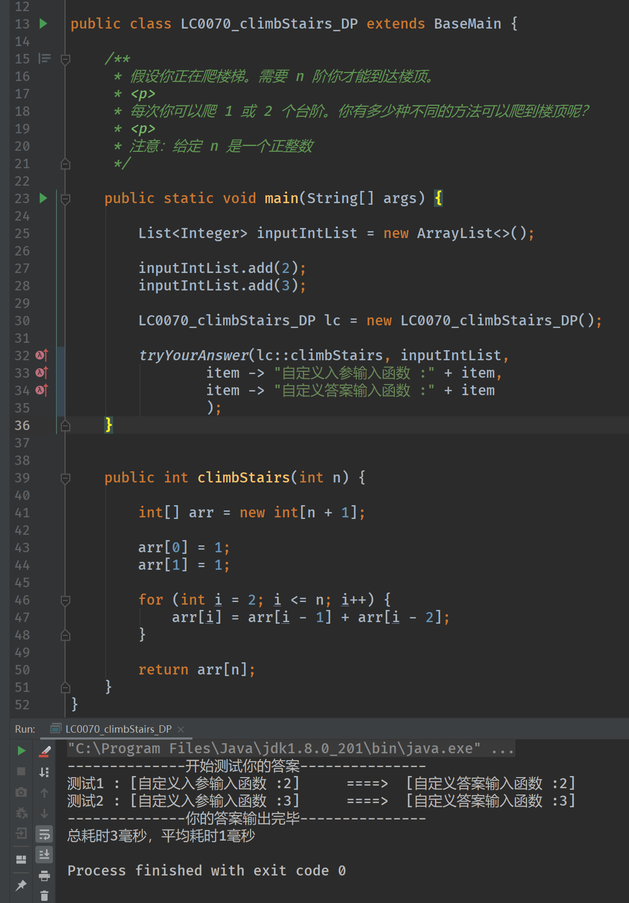

# LeetCodeAnswerFramework
一个简单的乐色框架，在leetcode做题的时候能更容易的在本地运行自己的的代码，同时不用频繁的调整函数体，也省去了每次都要新类对象的麻烦，支持批量输入输出。

## 使用方法：  
1.复制出一份main/java/LC000_demo，改成对应的题目名字和编号。  
2.将leetcode要求你编写的方法覆盖掉demo里的methodA方法，并且更改tryYourAnswer方法中对应的方法引用参数。  
3.根据要输入的类型，定义对应的List<E>,作为参数填入tryYourAnswer方法中。  
4.向入参List中添加你的入参。  
5.如果有需要，还可以传入自定义的入参/结果的字符串方法，方便查看。  
6.运行main方法即可。  

----------------------------------------
##v1.0版本

已有特性以及未来计划  
[x] 支持一元，二元以及三元入参，几乎可以涵盖大多数leetcode的题目  
[x] 可以自定义入参以及结果的toString方法，在打印的时候更加方便查看自己的输入输出  
[] 支持无限多元的入参  
[] 支持多线程类题目的运行框架  

示例

